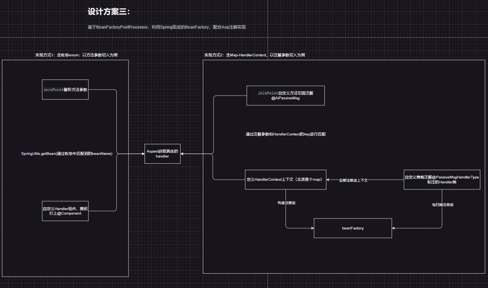

## 策略模式
### 设计方案1：
基于枚举和反射实现，按需实例化对应的策略

图略
### 设计方案2
手写策略工厂，基于InitializingBean#afterPropertiesSet自动注册所有策略到自己的策略工厂

图略
### 设计方案3：
基于BeanFactoryPostProcessor，利用Spring现成BeanFactory，配合Aop注解实现

兄弟们，一图胜千言


打印信息如下：
```shell
2024-09-14T21:54:53.265+08:00  INFO 8744 --- [           main] o.l.c.StrategyByAop                      : Starting StrategyByAop using Java 17.0.9 with PID 8744 (started by hasee in E:\github\spring-practice\custom_design_pattern_framework)
2024-09-14T21:54:53.267+08:00  INFO 8744 --- [           main] o.l.c.StrategyByAop                      : No active profile set, falling back to 1 default profile: "default"
2024-09-14T21:54:54.851+08:00  INFO 8744 --- [           main] o.l.c.StrategyByAop                      : Started StrategyByAop in 1.9 seconds (process running for 2.985)
2024-09-14T21:54:55.315+08:00  INFO 8744 --- [           main] o.l.c.strategyByAop.biz.BizServiceImpl   : applyPublish begin
2024-09-14T21:54:55.318+08:00  INFO 8744 --- [           main] o.l.c.s.aspect.AiPassiveMsgAspect        : handle by annotation param: audit.serviceVersion.publish
2024-09-14T21:54:55.321+08:00  INFO 8744 --- [           main] .c.s.h.a.PublishServiceVersionMsgHandler : PublishServiceVersionMsgHandler begin
2024-09-14T21:54:55.321+08:00  INFO 8744 --- [           main] o.l.c.s.h.methodHandler.ParamAHandler    : ParamAHandler begin
2024-09-14T21:54:55.321+08:00  INFO 8744 --- [           main] o.l.c.s.h.methodHandler.ParamBHandler    : ParamBHandler begin

2024-09-14T21:54:55.321+08:00  INFO 8744 --- [           main] o.l.c.strategyByAop.biz.BizServiceImpl   : approvePublish begin
2024-09-14T21:54:55.321+08:00  INFO 8744 --- [           main] o.l.c.s.aspect.AiPassiveMsgAspect        : handle by annotation param: audit.serviceVersion.publish.audit
2024-09-14T21:54:55.322+08:00  INFO 8744 --- [           main] a.ApprovePublishServiceVersionMsgHandler : ApprovePublishServiceVersionMsgHandler begin
2024-09-14T21:54:55.322+08:00  INFO 8744 --- [           main] o.l.c.s.h.methodHandler.ParamAHandler    : ParamAHandler begin
2024-09-14T21:54:55.322+08:00  INFO 8744 --- [           main] o.l.c.s.h.methodHandler.ParamBHandler    : ParamBHandler begin
```

# 更新日志
## 2024/9月更新

策略模式设计方案2优化, 新增策略模式方案4：

手写策略工厂，基于Spring3新特性，通过构造函数@Autowired批量注入策略Bean集合，见[strategyByHandsFactory](custom_design_pattern_framework%2Fsrc%2Fmain%2Fjava%2Forg%2Flyflexi%2Fcustom_design_pattern_framework%2FstrategyByHandsFactory)

图略
